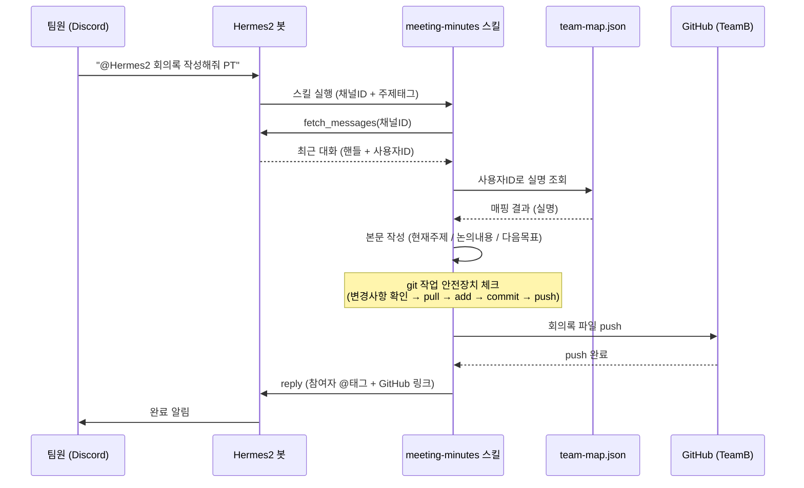

# 회의록·채널 요약 자동화 시스템 — 와이어프레임

이 시스템은 화면(UI)이 있는 앱이 아니라 Discord 채팅으로 트리거되고 결과가 GitHub 파일로 쌓이는 구조라, 화면 목업 대신 **①전체 처리 흐름**과 **②실제 사용자가 마주치는 지점(채팅, 결과 파일)** 두 가지로 나눠서 정리함.

---

## 1. 전체 처리 흐름



---

## 2. Discord 상호작용 목업

```
┌──────────────────────────────────────────────┐
│  # 박진                                        │
├──────────────────────────────────────────────┤
│                                                │
│  김정현                              1:59 PM  │
│  @Hermes2 회의록 작성해줘 PT                   │
│                                                │
│  Hermes2  [APP]                      2:00 PM  │
│  ⏳ 대화 가져오는 중...                         │
│                                                │
│  Hermes2  [APP]                      2:01 PM  │
│  @박진 @김정현 회의록 작성 완료했어요! 📝       │
│  **2026-07-29_PT_2차_회의록.md**               │
│  → github.com/Scalmia/TeamB/.../회의록/...    │
│                                                │
└──────────────────────────────────────────────┘
```

## 3. 채널 요약 목업

```
┌──────────────────────────────────────────────┐
│  # 이현우                                      │
├──────────────────────────────────────────────┤
│                                                │
│  김정현                              3:29 PM  │
│  @Hermes2 여기 요약해줘                        │
│                                                │
│  Hermes2  [APP]                      3:30 PM  │
│  **이현우**                                    │
│  - 새 기획안 "봇 프롬프팅 아레나" 제안          │
│  - 4주 일정, 4인 역할 구조 제시                 │
│  - 리스크: DSL 폭이 좁으면 프롬프트 차이가      │
│    승률에 안 드러날 수 있음                     │
│                                                │
│  ---                                           │
│  **결론**: 5번째 기획안 검토 필요 · 오늘 목표   │
│  "기획안 1개 선정"에 포함 여부 논의 필요         │
│                                                │
└──────────────────────────────────────────────┘
```

## 4. 결과 파일 구조

```
TeamB/
├── README.md
├── 회의록_자동화_시스템_기획.md
├── 시스템/
│   └── 와이어프레임.md            ← 이 문서
└── 회의록/
    ├── 2026-07-29_PT_1차_회의록.md
    ├── 2026-07-29_PT_2차_회의록.md
    └── ...                         (회차·주제별로 계속 누적)
```

## 5. 회의록 파일 내부 구조

```
┌──────────────────────────────────────┐
│ ---                                   │
│ 날짜: 2026-07-29                       │
│ 회차: 2                                │
│ 채널: PT (1531546896525430915)         │
│ 참여자: [박진, 김정현]                  │
│ 제목: PT 서비스 기능 우선순위 논의        │
│ ---                                   │
│                                        │
│ ## 현재 주제                           │
│ ...                                    │
│                                        │
│ ## 논의 내용                           │
│ - ...                                  │
│                                        │
│ ## 다음 목표                           │
│ - ...                                  │
└──────────────────────────────────────┘
```
