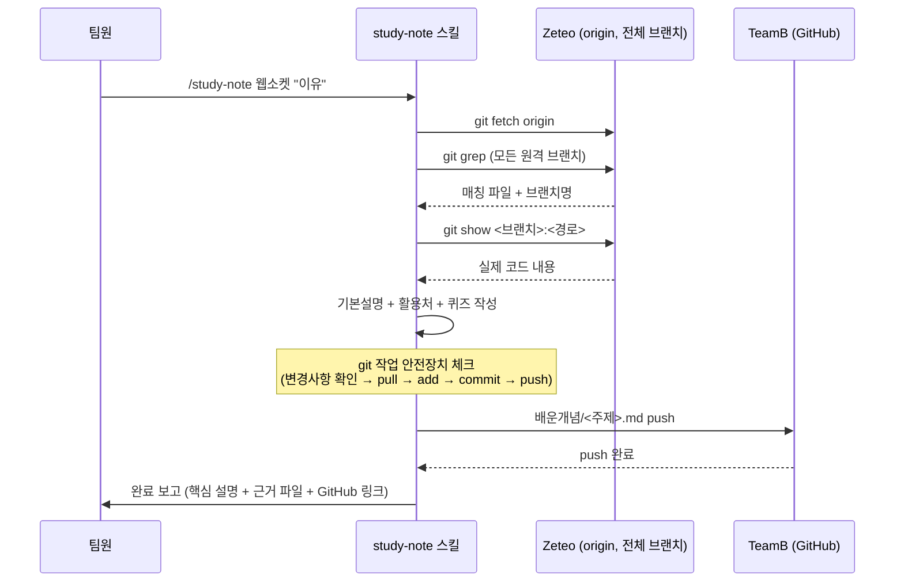

# 개념학습 기록 시스템 — 와이어프레임

1주차와 마찬가지로 화면(UI)이 있는 앱이 아니라 명령 한 줄로 트리거되고 결과가 GitHub 파일로 쌓이는 구조라, 화면 목업 대신 **①전체 처리 흐름**과 **②실제 사용자가 마주치는 지점** 위주로 정리함.

---

## 1. 전체 처리 흐름



---

## 2. 실행 목업 (Claude Code)

```
┌──────────────────────────────────────────────────┐
│  > /study-note 웹소켓 "팀프로젝트 실시간 동기화에  │
│    쓰인다고 해서 배웠다"                            │
│                                                    │
│  ⏳ Zeteo 전체 브랜치에서 "웹소켓" 관련 코드 조사 중 │
│                                                    │
│  ✅ feat/server 브랜치에서 발견                     │
│     apps/backend/src/socket/index.ts               │
│                                                    │
│  📝 배운개념/웹소켓.md 작성 완료                     │
│  ⬆️  TeamB main에 커밋·푸시 완료                     │
│     github.com/Scalmia/TeamB/.../웹소켓.md          │
└──────────────────────────────────────────────────┘
```

## 3. 결과 파일 구조

```
TeamB/
├── README.md
└── 2주차/
    ├── 개념학습_기록_시스템_기획.md
    ├── 시스템/
    │   ├── 유저 시나리오.md
    │   └── 시스템 설계도.md         ← 이 문서
    └── 배운개념/
        ├── 웹소켓.md
        └── ...                     (주제별로 계속 누적)
```

## 4. 배운개념 파일 내부 구조

```
┌────────────────────────────────────────┐
│ ---                                     │
│ 날짜: 2026-08-06                          │
│ 주제: 웹소켓                              │
│ 이유: 팀프로젝트 실시간 동기화에 쓰인다고   │
│       해서 배웠다                         │
│ ---                                     │
│                                          │
│ ## 기본설명                              │
│ ...                                     │
│                                          │
│ ## 우리 프로젝트에서의 활용처              │
│ - `apps/backend/src/socket/index.ts`     │
│   (feat/server 브랜치) — ...             │
│                                          │
│ ## 퀴즈                                  │
│ 1. ...                                  │
│    - 정답: ... (해설: ...)               │
└────────────────────────────────────────┘
```
