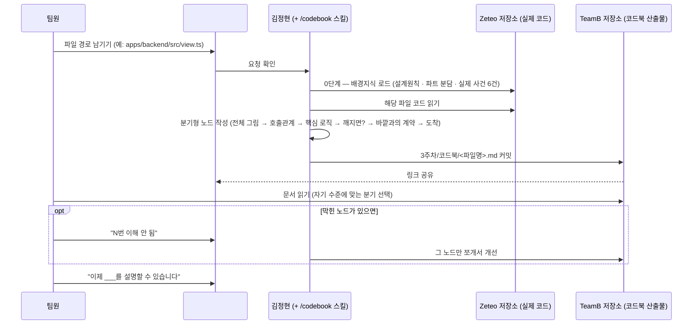

# 코드북 — 와이어프레임

화면(UI)이 있는 앱이 아니라, 디스코드 메시지 한 줄과 커맨드 한 번으로 트리거되고 결과가 GitHub 파일로 쌓이는 구조라 (2주차 개념학습 기록 시스템과 같은 형태), 화면 목업 대신 **①전체 처리 흐름**, **②실제 사용자가 마주치는 지점**, **③문서 내부의 분기 구조** 위주로 정리함.

---

## 1. 전체 처리 흐름



---

## 2. 실행 목업 (`#code-book` 채널)

```
┌──────────────────────────────────────────────────┐
│  📌 핀 메시지: 파일트리.md (메뉴판)                    │
│     읽고 싶은 파일 경로를 그대로 적어주세요             │
├──────────────────────────────────────────────────┤
│  이현우  apps/backend/src/view.ts                   │
│                                                      │
│  김정현  ⏳ 코드북 작성 중...                          │
│  김정현  ✅ 완료 — 3주차/코드북/view.md                │
│          github.com/Scalmia/TeamB/.../view.md       │
│                                                      │
│  이현우  8번 이해 안 됨 (설계원칙 5가 뭔지 모르겠어요)   │
│  김정현  ✅ 8번 노드 다시 씀                            │
│                                                      │
│  이현우  이제 view.ts가 왜 유일한 상태 출구인지          │
│          설명할 수 있습니다                            │
└──────────────────────────────────────────────────┘
```

---

## 3. 코드북 문서 내부 구조 (분기 노드)

실제 산출물(`view.md`)의 뼈대. 질문에 따라 다음 노드가 갈리고, 어느 경로든 같은 도착 노드로 모인다.

```
1번: 이 파일이 뭘 하는지 아시나요?
  ├─ 예  ────────────────────────────→ 6번
  └─ 아니오 → 2번 → 3번 → 4번 → 5번 ──→ 6번

6번(지도★): 이 파일이 하는 일 순서 요약
  ├─ survey가 별도 phase인 걸 아시나요? → 9번
  └─ 모르겠습니다 → 8번 → 9번

8~13번: 핵심 로직 · 유출 금지 필드 · 깨지면 무슨 일이 · 바깥과의 계약
                                    │
                                    ▼
14번(도착 🏁): "이제 이걸 설명할 수 있습니다" 요약
              + "더 볼 만한 곳" 표 (관련 파일 링크)
```

- **아는 사람은 4단계, 처음인 사람은 12단계**를 거치지만 도착점(14번)은 같다
- 도착 노드엔 항상 "📌 이해가 안 된 노드가 있으면 번호를 `#code-book`에 적어주세요"가 붙어 있어, 3번 화살표(막힌 노드 개선)로 다시 이어짐

---

## 4. 결과 파일 구조

```
TeamB/
├── README.md
└── 3주차/
    ├── 시스템/
    │   ├── 코드북_기획.md
    │   ├── 파일트리.md          (메뉴판)
    │   ├── 유저 시나리오.md
    │   └── 와이어프레임.md       ← 이 문서
    └── 코드북/
        ├── view.md
        └── ...                  (요청한 파일별로 계속 누적)
```
